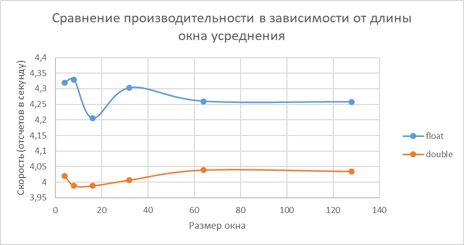

# Скользящее среднее

## Сборка и запуск

```bash
    mkdir build
    cd build
    cmake ..
    cmake --build . --config Release --target MovingAverage -j 8 -- # -j 8 заменить на кол-во ядер в Вашем CPU
    .\Release\MovingAverage.exe
```

## Сравнение производительности


